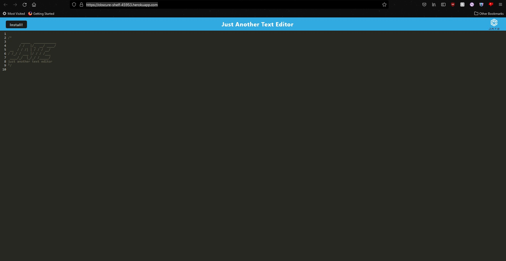

# <JATE>

## Description of this project
This project is J.A.T.E. an interactive text editor in browser that helps with keeping the data inplemented while also seperating them neatly by line.

## Installation

Need to use npm i to instal the required dependancies

## Link to Deployed Application
    https://obscure-shelf-45953.herokuapp.com/

 